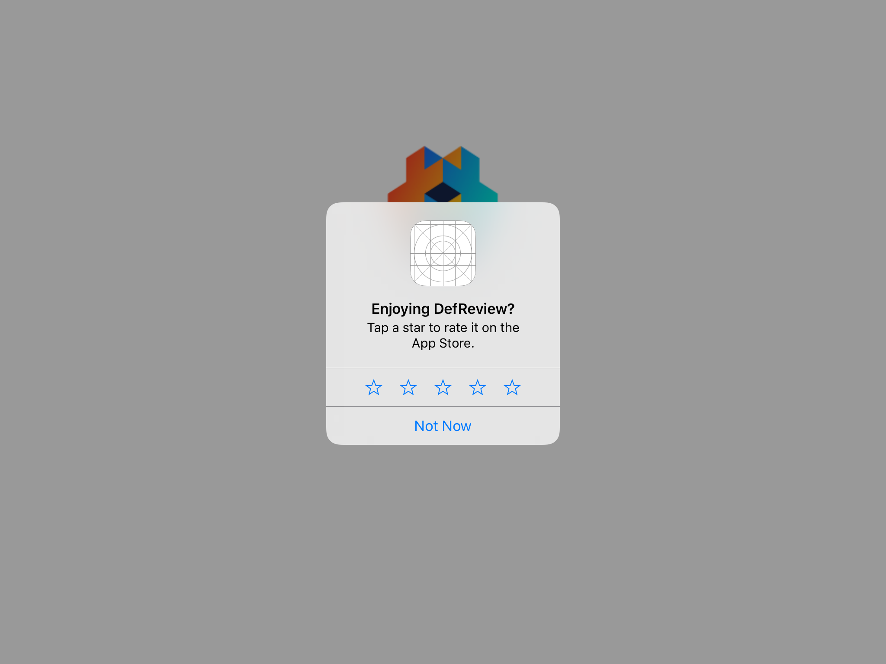

# Defold review and rating extension API documentation

Defold [native extension](https://www.defold.com/manuals/extensions/) which allows the use of [native iOS Ratings and Reviews window](https://developer.apple.com/ios/human-interface-guidelines/system-capabilities/ratings-and-reviews/) and [Google Play In-App Review API](https://developer.android.com/guide/playcore/in-app-review).

## Installation
To use this library in your Defold project, add the following URL to your `game.project` dependencies:

https://github.com/defold/extension-review/archive/master.zip

We recommend using a link to a zip file of a [specific release](https://github.com/defold/extension-review/releases)

## Example



```lua
if (review and review.is_supported()) then
  review.request_review()
else
  --do something else
end
```


## Source code

The source code is available on [GitHub](https://github.com/defold/extension-review)


## API reference
